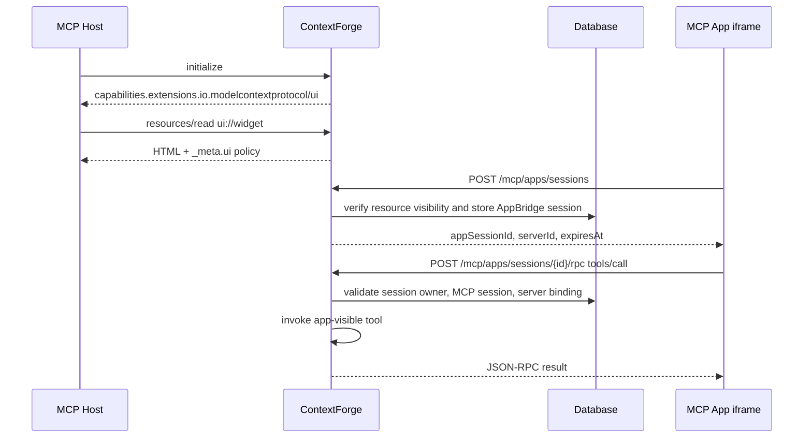

# MCP Apps

MCP Apps support lets ContextForge advertise MCP UI capabilities and enforce UI
metadata while keeping the feature disabled by default for a controlled rollout.
It introduces a narrow AppBridge path that browser-hosted MCP Apps can use to
call app-visible tools without exposing normal model-facing tool surfaces or
gateway-internal routing headers.

This page documents the implementation introduced for issue #5009. The broader
MCP Apps epic remains tracked in the roadmap.

## Status and Scope

MCP Apps support is feature flagged:

```bash
MCPGATEWAY_MCP_APPS_ENABLED=false
MCPGATEWAY_MCP_APPS_SESSION_TTL=900
```

When disabled, the gateway does not advertise MCP Apps capabilities and rejects
MCP Apps UI resource registration or AppBridge requests.

When enabled, the gateway can:

- advertise the `io.modelcontextprotocol/ui` capability during MCP
  initialization for authenticated callers;
- store UI metadata on tools and resources through the shared
  `extensionMetadata` field;
- project known MCP Apps metadata into MCP protocol `_meta.ui` fields;
- filter app-only tools out of model-facing tool listings;
- create short-lived AppBridge sessions bound to a user, MCP session, virtual
  server, and UI resource;
- allow AppBridge RPC calls only to tools marked for app use.

The current AppBridge RPC surface supports `tools/call`. Other MCP methods are
rejected with JSON-RPC `Method not found`.

## MCP Capability

For authenticated MCP initialization requests, the gateway advertises:

```json
{
  "capabilities": {
    "extensions": {
      "io.modelcontextprotocol/ui": {
        "version": "2025-06-02",
        "resources": {
          "schemes": ["ui://"]
        },
        "bridge": {
          "methods": ["tools/call"]
        }
      }
    }
  }
}
```

The capability is omitted when MCP Apps are disabled or when the caller is not
authorized.

## Metadata Model

ContextForge stores MCP Apps data in the `extensionMetadata` object on tools
and resources. MCP Apps metadata is keyed by the MCP UI capability identifier:

```json
{
  "extensionMetadata": {
    "io.modelcontextprotocol/ui": {
      "audience": ["model"],
      "resourceUri": "ui://widgets/customer-search"
    }
  }
}
```

The gateway also accepts the internal snake_case form, `extension_metadata`, in
Python service paths. Public API payloads should use `extensionMetadata`.

### Tool Metadata

Tool metadata controls who sees or can invoke the tool:

```json
{
  "name": "open_customer_widget",
  "description": "Open the customer search widget.",
  "inputSchema": {
    "type": "object",
    "properties": {
      "customerId": {
        "type": "string"
      }
    }
  },
  "extensionMetadata": {
    "io.modelcontextprotocol/ui": {
      "audience": ["model"],
      "resourceUri": "ui://widgets/customer-search"
    }
  }
}
```

Audience behavior:

| Audience | Model-facing `tools/list` | AppBridge `tools/call` |
| -------- | ------------------------- | ---------------------- |
| omitted  | visible                   | denied                 |
| `model`  | visible                   | denied                 |
| `app`    | hidden                    | allowed                |
| `model`, `app` | visible             | allowed                |

Use `audience: ["app"]` for helper tools that should only be callable by UI
code running through a validated AppBridge session.

### UI Resource Metadata

MCP Apps UI resources use the `ui://` URI scheme and must be HTML:

```json
{
  "uri": "ui://widgets/customer-search",
  "name": "Customer search widget",
  "mimeType": "text/html",
  "content": "<!doctype html><html>...</html>",
  "extensionMetadata": {
    "io.modelcontextprotocol/ui": {
      "csp": {
        "default-src": ["'self'"],
        "connect-src": ["'self'"],
        "script-src": ["'self'"],
        "style-src": ["'self'"]
      },
      "sandbox": ["allow-scripts", "allow-forms"],
      "permissions": []
    }
  }
}
```

For `ui://` resources, ContextForge requires all of the following:

- MCP Apps must be enabled.
- `mimeType` must be `text/html`; parameterized values such as
  `text/html; charset=utf-8` are accepted.
- `extensionMetadata["io.modelcontextprotocol/ui"]` must exist.
- `csp` must be a non-empty object.
- `sandbox` must be a non-empty list.

## CSP and Sandbox Validation

The gateway validates CSP metadata before accepting a UI resource.

Allowed CSP directives:

- `connect-src`
- `default-src`
- `font-src`
- `frame-src`
- `img-src`
- `media-src`
- `script-src`
- `style-src`

Rejected CSP sources:

- `*`
- `javascript:`
- `file:`
- `data:`
- `script-src 'unsafe-inline'`
- `script-src 'unsafe-eval'`

Allowed sandbox tokens:

- `allow-downloads`
- `allow-forms`
- `allow-modals`
- `allow-popups`
- `allow-scripts`

The gateway deliberately rejects high-risk sandbox tokens such as
`allow-same-origin` and `allow-popups-to-escape-sandbox`.

Permission tokens are optional. When present, each token must be lowercase,
start with a letter, and contain only letters, digits, or hyphens.

## AppBridge Flow

AppBridge requests use short-lived sessions. A session binds four independent
facts:

- the authenticated gateway user;
- the MCP session ID;
- the virtual server ID;
- the `ui://` resource URI.



### Create an AppBridge Session

```http
POST /mcp/apps/sessions
Authorization: Bearer <token>
Mcp-Session-Id: <mcp-session-id>
Content-Type: application/json

{
  "resourceUri": "ui://widgets/customer-search",
  "serverId": "server-123"
}
```

Successful response:

```json
{
  "appSessionId": "5a51a7f8-4aa5-48d9-9aa1-3f4b5f07ed76",
  "resourceUri": "ui://widgets/customer-search",
  "serverId": "server-123",
  "expiresAt": "2026-06-05T15:30:00+00:00"
}
```

The session endpoint requires `resources.read`. Before creating the session,
the gateway reads the requested UI resource with the caller's normal token
scope and RBAC context.

### Call an App-Visible Tool

```http
POST /mcp/apps/sessions/5a51a7f8-4aa5-48d9-9aa1-3f4b5f07ed76/rpc
Authorization: Bearer <token>
Mcp-Session-Id: <mcp-session-id>
Content-Type: application/json

{
  "jsonrpc": "2.0",
  "id": "call-1",
  "method": "tools/call",
  "params": {
    "name": "customer_widget_lookup",
    "arguments": {
      "customerId": "C123"
    }
  }
}
```

The RPC endpoint requires `tools.execute`. The tool must resolve within the
stored server binding and must be app-visible through
`audience: ["app"]` or `audience: ["model", "app"]`.

## Security Invariants

MCP Apps cross a browser UI boundary, so ContextForge treats AppBridge as a
separate, constrained execution path.

The gateway enforces:

- **Feature flag deny-by-default:** all MCP Apps routes and `ui://` resources
  are unavailable unless `MCPGATEWAY_MCP_APPS_ENABLED=true`.
- **Session ownership before bridge creation:** AppBridge sessions require an
  existing MCP session owned by the same user, unless the requester has admin
  bypass.
- **Explicit server binding:** AppBridge sessions require `serverId`; RPC calls
  cannot switch to a different server through headers or request parameters.
- **Resource visibility first:** creating an AppBridge session reads the
  `ui://` resource through normal token scoping and RBAC before persisting the
  session.
- **Tool visibility split:** app-only helper tools are hidden from model-facing
  `tools/list`; model-only tools are rejected by AppBridge.
- **No direct-proxy header trust:** AppBridge strips
  `X-Context-Forge-Gateway-Id` before invoking tools and uses the stored
  server binding instead.
- **Short-lived sessions:** sessions expire after
  `MCPGATEWAY_MCP_APPS_SESSION_TTL` seconds.
- **Strict UI policy:** `ui://` resources require explicit CSP and sandbox
  metadata before registration.

These checks complement, but do not replace, the normal two-layer ContextForge
security model: token scoping controls what a caller can see, and RBAC controls
what a caller can do.

## Operational Guidance

Enable MCP Apps only for deployments that intentionally serve trusted UI
resources:

```bash
MCPGATEWAY_MCP_APPS_ENABLED=true
MCPGATEWAY_MCP_APPS_SESSION_TTL=900
```

Recommended rollout steps:

1. Keep the feature disabled in production until at least one UI resource and
   its AppBridge helper tools have been reviewed together.
2. Register `ui://` resources with the narrowest CSP and sandbox policies that
   still allow the UI to function.
3. Mark helper tools with `audience: ["app"]` unless the model also needs to
   call them directly.
4. Exercise deny paths during validation: wrong MCP session, wrong server ID,
   missing CSP, missing sandbox, app calling model-only tool, and model listing
   app-only tool.
5. Monitor normal audit, token usage, and structured logs for AppBridge session
   creation and tool invocation failures.

## Related Files

- `mcpgateway/services/mcp_apps.py` - metadata validation, capability payload,
  model/app filtering, and AppBridge session helper.
- `mcpgateway/main.py` - AppBridge session and RPC endpoints.
- `mcpgateway/services/tool_service.py` - app-visible tool invocation guard.
- `mcpgateway/services/resource_service.py` - `ui://` resource validation.
- `mcpgateway/services/mcp_method_registry.py` - MCP method routing helper.
- `mcpgateway/alembic/versions/b6c7d8e9f0a1_add_mcp_app_metadata.py`
  - database migration for MCP Apps metadata and AppBridge sessions.
